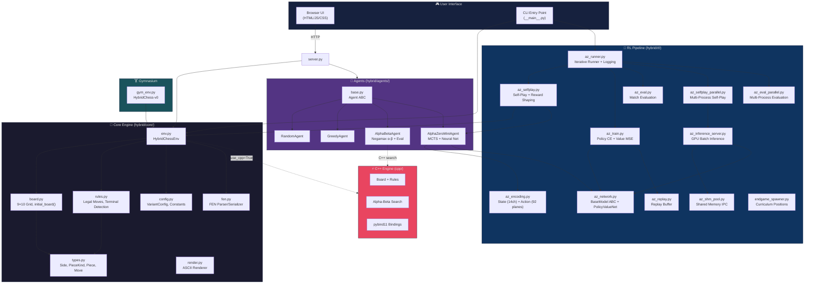
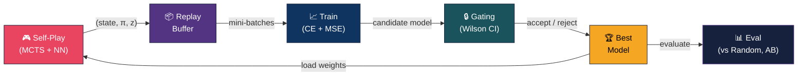
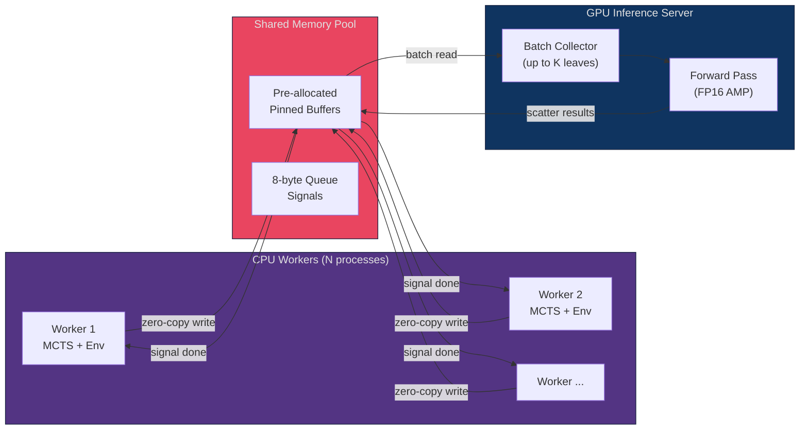
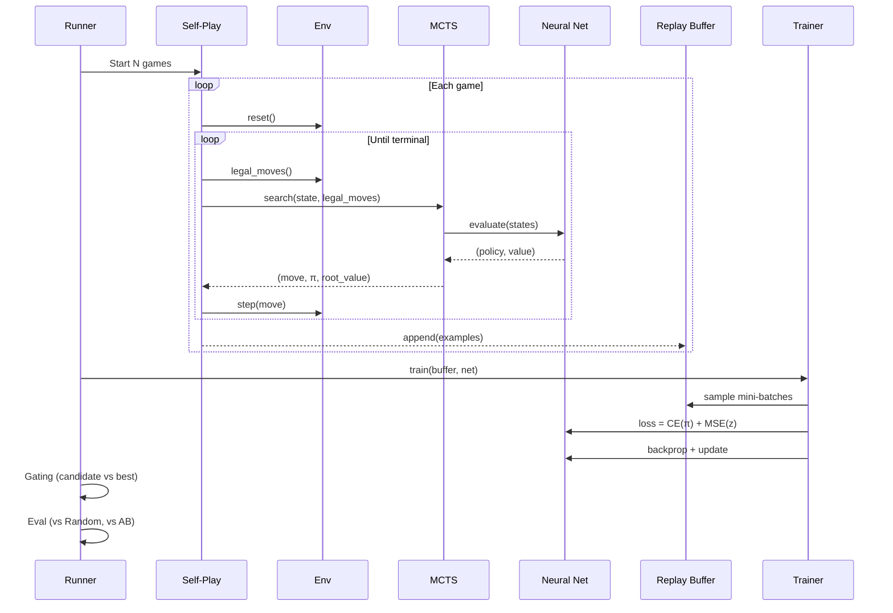

# Architecture Overview

This document describes the high-level architecture of Hybrid Chess, a production-grade AlphaZero implementation for asymmetric board games.

## System Architecture



---

## Module Details

### Core Engine (`hybrid/core/`)

The game engine is the foundation. It implements the rules and state management for **asymmetric chess** — International Chess (bottom) vs Chinese Chess / Xiangqi (top) on a shared 9×10 board.

| Module | Responsibility |
|--------|---------------|
| **types.py** | Frozen dataclasses: `Side` (Chess/Xiangqi), `PieceKind` (13 kinds), `Piece`, `Move` |
| **board.py** | `Board` class (9×10 grid stored as `grid[y][x]`), `initial_board(variant)` setup |
| **rules.py** | `generate_legal_moves()`, `apply_move()`, `terminal_info()`, check detection |
| **config.py** | `VariantConfig` (frozen dataclass), board constants, legacy global flags |
| **env.py** | `HybridChessEnv` — gym-like API: `reset()`, `step()`, `legal_moves()` |
| **fen.py** | `parse_fen()` / `board_to_fen()` for arbitrary position setup |
| **render.py** | ASCII board renderer (uppercase = Chess, lowercase = Xiangqi) |

#### Key Design Decisions

- **Asymmetric piece types**: Chess and Xiangqi pieces have distinct `PieceKind` enums (e.g., `KNIGHT` vs `HORSE`), allowing each side to retain its native piece movement rules.
- **VariantConfig**: Frozen dataclass passed to `HybridChessEnv`, replacing mutable global flags. Thread-safe and serializable.
- **Dual engine**: Pure Python path for simplicity; optional C++ path (pybind11) for ~50× speedup.

### AlphaZero Pipeline (`hybrid/rl/`)

The RL pipeline implements a complete AlphaZero training system:



| Module | Responsibility |
|--------|---------------|
| **az_network.py** | `BaseModel` ABC + `PolicyValueNet` (dual-head ResNet: 14→64ch, 3 res blocks) |
| **az_encoding.py** | State → (14, 10, 9) tensor; Move → 92-plane action index |
| **az_selfplay.py** | Full self-play game loop with resign, draw adjudication, reward shaping hook |
| **az_train.py** | Training loop: policy cross-entropy + value MSE loss |
| **az_eval.py** | Match evaluation with win/draw/loss statistics, Wilson & score CI |
| **az_runner.py** | Iterative orchestrator: self-play → train → gate → eval, CSV + WandB logging |
| **az_replay.py** | Ring buffer with `.npz` serialization |
| **az_inference_server.py** | Centralized GPU inference: batches N workers' requests into one forward pass |
| **az_shm_pool.py** | Zero-copy shared memory pool for worker ↔ server communication |
| **az_selfplay_parallel.py** | Multi-process self-play via `torch.multiprocessing.spawn` |
| **az_eval_parallel.py** | Multi-process gating and evaluation matches |
| **endgame_spawner.py** | Generate random endgame positions for curriculum learning |

#### State & Action Encoding

```
State Encoding — 14 binary planes (10 × 9 each):
┌───────────────────────────────────────┐
│ Ch 0:  King positions                 │
│ Ch 1:  Queen positions                │
│ Ch 2:  Rook positions                 │
│ Ch 3:  Bishop positions               │
│ Ch 4:  Knight positions               │
│ Ch 5:  Pawn positions                 │
│ Ch 6:  General positions              │
│ Ch 7:  Advisor positions              │
│ Ch 8:  Elephant positions             │
│ Ch 9:  Horse positions                │
│ Ch 10: Chariot positions              │
│ Ch 11: Cannon positions               │
│ Ch 12: Soldier positions              │
│ Ch 13: Side-to-move (1 = Chess)       │
└───────────────────────────────────────┘

Action Space — 92 planes × 10 × 9 = 8,280 actions:
  Planes  0–71: Sliding (8 directions × 9 distances)
  Planes 72–79: Knight/Horse (8 L-shaped deltas)
  Planes 80–91: Promotions (3 dx × 4 piece types)
```

#### Neural Network Architecture

```
PolicyValueNet (default):
  Input: (B, 14, 10, 9)
    ↓
  Conv2d 3×3 (14 → 64) + BN + ReLU
    ↓
  3 × ResidualBlock (64ch: Conv → BN → ReLU → Conv → BN → Skip → ReLU)
    ↓
  ┌─── Policy Head ──────────────────┐  ┌─── Value Head ─────────────────┐
  │ Conv2d 1×1 (64 → 92)            │  │ Conv2d 1×1 (64 → 1) + BN      │
  │ Output: (B, 92, 10, 9) logits   │  │ → flatten → FC(90→64) → ReLU  │
  └──────────────────────────────────┘  │ → FC(64→1) → tanh             │
                                        │ Output: (B, 1) ∈ [-1, 1]      │
                                        └─────────────────────────────────┘
```

Users can subclass `BaseModel` to define custom architectures (Transformer, MobileNet, etc.).

### Performance Optimizations

The system uses multiple layers of acceleration:



| Layer | Technique | Impact |
|-------|-----------|--------|
| **Engine** | C++ via pybind11 | ~50× faster move gen + terminal detection |
| **Inference** | Centralized GPU server, batched forward passes | Amortize GPU kernel launch across N workers |
| **Memory** | `SharedMemoryPool`, zero-copy, pinned DMA buffers | Eliminate pickling overhead |
| **MCTS** | Leaf batching with virtual loss | K leaves evaluated in one GPU call |
| **Precision** | FP16 autocast + TF32 matmul (Ampere+) | ~2× inference throughput |
| **Encoding** | `encode_batch_gpu()` — scatter-based one-hot on GPU | Zero-allocation hot path |
| **Parallelism** | `torch.multiprocessing.spawn` | Scales linearly with CPU cores |

### Agents (`hybrid/agents/`)

All agents implement the `Agent` ABC from `base.py`:

```python
class Agent(ABC):
    name: str = "agent"

    @abstractmethod
    def select_move(self, state: GameState, legal_moves: List[Move]) -> Move:
        ...
```

| Agent | Strategy | Typical Use |
|-------|----------|-------------|
| `RandomAgent` | Uniform random over legal moves | Baseline / smoke testing |
| `GreedyAgent` | 1-ply capture maximizer | Fast baseline |
| `AlphaBetaAgent` | Negamax α-β + hand-crafted eval | Non-learned baseline (depth 1–4) |
| `AlphaZeroMiniAgent` | MCTS + PolicyValueNet | RL-trained agent |

### Web Interface (`ui/`)

The browser-based UI is served by a zero-dependency HTTP server (`server.py`):

- **Landing page** (`ui/index.html`): Choose game mode
- **Play** (`ui/play/`): Interactive human-vs-AI with move highlighting
- **Replay** (`ui/replay/`): Review recorded games move-by-move
- **Shared** (`ui/shared/`): Common board renderer and CSS

### Gymnasium Integration (`gym_env.py`)

Standard Gymnasium wrapper registered as `HybridChess-v0`:

```
Observation: Box(14, 10, 9)  — binary piece planes + side-to-move
Action:      Discrete(8280)  — 92 × 10 × 9 flat action space
Reward:      +1 / 0 / -1    — win / draw / loss from mover's perspective
Info:        {"legal_actions": [...], "side_to_move": "chess", "ply": 0}
```

Compatible with any RL framework that supports Gymnasium (Stable-Baselines3, CleanRL, RLlib, etc.).

---

## Data Flow: One Training Iteration


