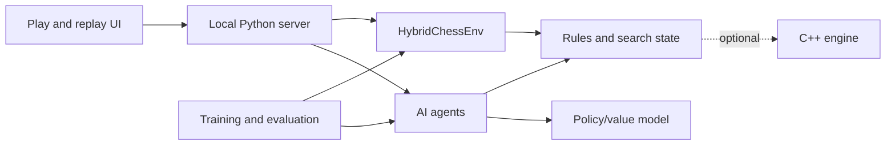
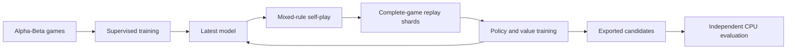

# Architecture

Hybrid Chess shares one game model between local play, AI search and training.
This guide describes the main extension points and the boundaries that matter
when changing the code.

```mermaid
flowchart LR
    Browser[Play and replay UI] --> HTTP[Local Python server]
    HTTP --> Env[HybridChessEnv]
    HTTP --> Agents[AI agents]
    Agents --> Rules[Rules and search state]
    Env --> Rules
    Rules -. optional .-> CPP[C++ engine]
    Training[Training and evaluation] --> Env
    Training --> Agents
    Agents --> Model[Policy/value model]
```

## Game state and rules

| Module | Responsibility |
| --- | --- |
| `hybrid/core/types.py` | Armies, piece kinds, pieces and moves. |
| `hybrid/core/board.py` | A 9 × 10 grid and variant-specific starting layouts. |
| `hybrid/core/config.py` | `VariantConfig` and board/game constants. |
| `hybrid/core/rules.py` | Legal moves, attacks, move application and terminal results. |
| `hybrid/core/env.py` | Game state, turn changes, repetition history and Python/C++ dispatch. |
| `hybrid/core/fen.py` | Position serialization for custom setups. |
| `hybrid/web_variants.py` | Six presets, bilingual descriptions, validation and normalization. |

The board uses `grid[y][x]`, with `(0, 0)` at a1. Chess and Xiangqi have distinct
piece kinds, including separate queens. A `GameState` carries its board, side to
move, ply count, repetition dictionary, variant and move limit. Search children
copy their repetition history and record their own successor position.

`VariantConfig` is immutable, but low-level rules still have an active
module-level configuration. Environment operations and search activate the
configuration belonging to their game. This supports sequential use of different
variants; it does not make simultaneous searches with different rules in one
process thread-safe. Parallel game generation uses separate processes.

The optional pybind11 extension in `cpp/` implements move generation, attacks,
terminal detection and Alpha-Beta search. Python remains the path used by the web
Alpha-Beta opponents. Changes to shared rule behavior need Python/C++ parity
checks. Performance depends on the position, search settings and hardware.

## Local play

`hybrid/server.py` uses Python's standard-library `HTTPServer`. It serves one
in-memory game and the static `ui/` files. The browser keeps pending opening
settings separate from the active game and serializes actions. Server-side
validation checks game identity, revision, turn, legal moves and terminal state.

| Endpoint | Purpose |
| --- | --- |
| `GET /api/agents` | Available opponents, including compatible optional models. |
| `GET /api/variants` | Presets and bilingual rule descriptions. |
| `GET /api/state` | Current game, configuration, history, check and result. |
| `POST /api/preview` | Starting board for proposed rules, without changing the active game. |
| `POST /api/new` | Start a game from validated settings. |
| `POST /api/move`, `POST /api/ai_move` | Advance the active game. |
| `POST /api/undo`, `POST /api/resign` | Undo a player turn or end the game. |

State revisions let the server reject stale or repeated actions. After a failed
request the UI synchronizes state before allowing another attempt. Refreshing
the page restores server state, while restarting the process starts a new session.
This is a local single-game server, without accounts or a persistent game database.

`ui/play/` owns the playing interface, `ui/replay/` owns recording import and
playback, and `ui/shared/` contains the SVG renderer, styles and bilingual strings.
There is no frontend framework or asset build step. Language changes rerender
text without replacing the game state.

## Agents and models

Agents implement `select_move(state, legal_moves)` from `hybrid/agents/base.py`.
Random samples a legal move; Greedy prioritizes captures; Alpha-Beta uses a
handwritten evaluation with iterative deepening and optional time limits.
`AlphaZeroMiniAgent` combines policy/value predictions with MCTS.

Network values are from the side-to-move perspective. MCTS negates values between
turns, tracks repetition along each branch, and can gather several leaves for a
batched prediction. Virtual loss discourages selecting paths already being
evaluated. Deadlines return a usable search result or a legal fallback.

The general model in `hybrid/rl/general_model.py` uses a versioned 29-plane input:
14 piece planes, side to move, 12 effective rule switches, remaining-move fraction
and current repetition count. MCTS keeps the full history even though the model
sees a summary. Its default network has four residual blocks and 96 channels.
The shared policy layout has 92 move planes over 10 × 9 squares; probabilities
are compared only across the current position's legal moves.

Older `az_*` training commands and the optional `HybridChess-v0` Gymnasium wrapper
retain their 15-plane observation format. They are separate interfaces, not
interchangeable with general-model version 2 weights or replay data.

## Training and evaluation

```mermaid
flowchart LR
    Teacher[Alpha-Beta games] --> SL[Supervised training]
    SL --> Latest[Latest model]
    Latest --> SP[Mixed-rule self-play]
    SP --> Replay[Complete-game replay shards]
    Replay --> Train[Policy and value training]
    Train --> Latest
    Train --> Candidate[Exported candidates]
    Candidate --> Eval[Independent CPU evaluation]
```

| Module | Responsibility |
| --- | --- |
| `general_model.py` | Versioned features, model loading and rule sampling. |
| `general_games.py` | Seeded game identities, teacher/self-play workers and complete-game shards. |
| `general_train.py` | Supervised learning, self-play iterations and resumable training progress. |
| `general_eval.py` | Paired openings, army-specific results and CPU latency reports. |
| `run_store.py` | Atomic writes, checksums, checkpoint retention and random-state recovery. |
| `az_inference_server.py`, `az_shm_pool.py` | Shared-memory requests and batched GPU inference for workers. |

Each self-play iteration uses a frozen model for collection. Its update becomes
the next model used for exploration; evaluation saves results separately. Policy
training retains all legal actions, including those with zero search visits.
Value targets use final game outcomes rather than predicted or material-based
adjudications.

Full recovery needs both the checkpoint and its referenced game shards. Exported
model weights are smaller inference artifacts with explicit format metadata.
The [AI guide](GENERAL_AI.md) covers the recipe, cluster execution, recovery limits
and how to distribute a model with reproducible evaluation evidence.
